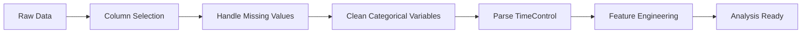

# ♟️ Chess Games Data Analysis

<p align="center">
  
  
  
  
  
</p>

<p align="center">
  <strong>An end-to-end data analysis project exploring 500,000+ chess games from Lichess.org</strong>
</p>

<p align="center">
  <a href="#-project-overview">Overview</a> •
  <a href="#-key-findings">Key Findings</a> •
  <a href="#️-technologies">Technologies</a> •
  <a href="#-project-structure">Structure</a> •
  <a href="#-getting-started">Getting Started</a> •
  <a href="#-methodology">Methodology</a>
</p>

---

## 📋 Project Overview

This project performs a comprehensive **Exploratory Data Analysis (EDA)** on a large-scale chess dataset from [Lichess.org](https://lichess.org), one of the world's largest online chess platforms. The analysis covers the complete data science pipeline, from data wrangling to statistical hypothesis testing.

### 🎯 Objectives

- **Understand player behavior** across different skill levels (Elo ratings)
- **Analyze game patterns** including openings, time controls, and outcomes
- **Test statistical hypotheses** about chess dynamics using rigorous methods
- **Demonstrate proficiency** in Python data science stack

### 📊 Dataset

| Metric            | Value                            |
| ----------------- | -------------------------------- |
| **Source**        | Lichess.org (July 2016)          |
| **Original Size** | 6.25 Million games (~4GB)        |
| **Sample Used**   | 500,000 games                    |
| **Features**      | 14 columns                       |
| **Data Types**    | Numerical, Categorical, DateTime |

---

## 🔍 Key Findings

### 📈 Statistical Hypothesis Testing Results

Three hypotheses were rigorously tested using appropriate statistical methods:

| #   | Hypothesis                                                         | Test                   | Result             | p-value |
| --- | ------------------------------------------------------------------ | ---------------------- | ------------------ | ------- |
| 1   | **Elo Advantage**: Higher-rated White players win more often       | Two-sample t-test      | ✅ **Rejected H₀** | < 0.001 |
| 2   | **Time-Skill Correlation**: Higher Elo players prefer longer games | Pearson Correlation    | ✅ **Rejected H₀** | < 0.001 |
| 3   | **White's Advantage**: White wins >50% of decisive games           | Z-test for proportions | ✅ **Rejected H₀** | < 0.001 |

### 💡 Key Insights

1. **White has a measurable first-move advantage**
   - 51.83% win rate in decisive games (vs 48.17% for Black)
   - Statistically significant with p-value ≈ 10⁻¹⁴²

2. **Higher-rated players prefer faster time controls**
   - Negative correlation (r = -0.154) between Elo and base time
   - Suggests skilled players are comfortable with blitz/bullet formats

3. **Rating strongly predicts game outcome**
   - Mean White Elo when White wins: **1,776**
   - Mean White Elo when Black wins: **1,702**
   - Difference of 74 Elo points is highly significant (t = 97.89)

---

## 🛠️ Technologies

### Languages & Environment

```
Python 3.8+
Jupyter Notebook
```

### Data Manipulation & Analysis

```python
pandas >= 2.0        # DataFrames and data manipulation
numpy >= 1.24        # Numerical computing
```

### Visualization

```python
matplotlib >= 3.7    # Static plots
seaborn >= 0.12      # Statistical visualizations
```

### Statistical Analysis

```python
scipy >= 1.10        # Statistical tests (t-test, Pearson correlation)
statsmodels >= 0.14  # Proportion z-test
```

---

## 📁 Project Structure

```
projeto final/
│
├── 📓 final-project.ipynb    # Main Jupyter notebook with complete analysis
├── 📊 chess_games.csv        # Dataset (500K sampled games)
└── 📄 README.md              # Project documentation (this file)
```

### Notebook Organization

The notebook is structured into **7 main sections**:

```
1. Setup & Data Loading
   └── Library imports, data loading, initial inspection

2. Data Understanding
   └── Shape, dtypes, missing values, statistical summary

3. Data Wrangling
   ├── 3.1 Column selection and renaming
   └── 3.2 Categorical variable cleaning
       ├── Event (game type)
       ├── Result (game outcome)
       ├── Opening Code (ECO classification)
       ├── Variation (opening name)
       └── TimeControl (parsing to numeric)

4. Data Filtering
   ├── 4.1 High-Elo games analysis (≥1920)
   └── 4.2 Aggregations by opening variation

5. Data Visualization
   ├── 5.1 Histograms (Elo distributions)
   └── 5.2 Boxplots (feature distributions)

6. Feature Engineering
   ├── 6.1 One-hot encoding
   ├── 6.2 Log transformation for skewed variables
   └── 6.3 Feature relationships (pairplots, correlation)

7. Hypothesis Testing
   ├── H1: Elo advantage analysis
   ├── H2: Time-skill correlation
   ├── H3: White's first-move advantage
   └── Summary table
```

---

## 🚀 Getting Started

### Prerequisites

Make sure you have Python 3.8+ installed. You can check with:

```bash
python --version
```

### Installation

1. **Clone the repository**

```bash
git clone https://github.com/yourusername/chess-analysis.git
cd chess-analysis
```

2. **Create a virtual environment** (recommended)

```bash
python -m venv venv
source venv/bin/activate  # On Windows: venv\Scripts\activate
```

3. **Install dependencies**

```bash
pip install pandas numpy matplotlib seaborn scipy statsmodels jupyter
```

4. **Launch Jupyter Notebook**

```bash
jupyter notebook final-project.ipynb
```

### Quick Start

```python
# Import libraries
import pandas as pd
import matplotlib.pyplot as plt
from scipy import stats

# Load data
df = pd.read_csv('chess_games.csv')

# Sample for faster processing
df = df.sample(n=500000, random_state=42)

# Quick analysis
print(df.describe())
```

---

## 📐 Methodology

### Data Cleaning Pipeline



### Data Transformations Applied

| Transformation     | Columns Affected                         | Purpose                       |
| ------------------ | ---------------------------------------- | ----------------------------- |
| String strip       | `Event`                                  | Remove whitespace             |
| Filter invalid     | `Result`                                 | Remove games with '\*' result |
| Extract first char | `Opening Code` → `eco_group`             | Group openings (A-E)          |
| Reduce cardinality | `Variation` → `variation_clean`          | Keep top 20 + 'Other'         |
| Parse format       | `TimeControl` → `base_time`, `increment` | Convert to numeric            |
| One-hot encoding   | Categorical columns                      | ML-ready features             |
| Log transformation | `base_time`, `increment`                 | Reduce skewness               |
| Label encoding     | `Result`                                 | 0=Black, 1=Draw, 2=White      |

### Statistical Tests Explained

#### 1. Two-Sample Independent t-Test

- **Purpose**: Compare means between two groups
- **Application**: White Elo when White wins vs when Black wins
- **Assumptions**: Independence, normality (satisfied by large n)

#### 2. Pearson Correlation

- **Purpose**: Measure linear relationship between variables
- **Application**: `base_time` vs `WhiteElo`
- **Coefficient interpretation**: r = -0.154 (weak negative)

#### 3. One-Tailed Z-Test for Proportions

- **Purpose**: Test if proportion exceeds a threshold
- **Application**: White win proportion > 0.5
- **Result**: Highly significant (z = 25.34)

---

## 📊 Visualizations

The project includes various visualization types:

- **Histograms**: Distribution of Elo ratings (White/Black)
- **Boxplots**: Feature distributions and outlier detection
- **Scatter plots**: Correlation between time control and skill
- **Bar charts**: Feature correlation with game result
- **Pair plots**: Multi-feature relationship exploration

---

## 🎓 Skills Demonstrated

| Category                | Skills                                                                                   |
| ----------------------- | ---------------------------------------------------------------------------------------- |
| **Data Wrangling**      | Pandas operations, string manipulation, datetime parsing, handling missing data          |
| **EDA**                 | Descriptive statistics, distribution analysis, correlation analysis                      |
| **Visualization**       | Matplotlib, Seaborn, multi-panel figures, publication-ready plots                        |
| **Statistics**          | Hypothesis testing, t-tests, correlation tests, proportion tests, p-value interpretation |
| **Feature Engineering** | One-hot encoding, label encoding, log transformations, cardinality reduction             |
| **Best Practices**      | Clean code, documentation, reproducibility (random_state), modular structure             |

---

## 📈 Future Improvements

- [ ] Build predictive model for game outcome
- [ ] Analyze opening effectiveness by Elo bracket
- [ ] Time series analysis of game patterns
- [ ] Interactive dashboard with Plotly/Streamlit
- [ ] Deep dive into specific openings (e.g., Sicilian Defense)

---

## 👤 Author

**[Your Name]**

- LinkedIn: [murilo-emanoel](https://www.linkedin.com/in/murilo-emanoel/)
- Email: muriloemanoel.contato@gmail.com

---

<p align="center">
  <strong>⭐ If you found this project interesting, please consider giving it a star! ⭐</strong>
</p>

<p align="center">
  Made with ❤️ and ♟️
</p>
